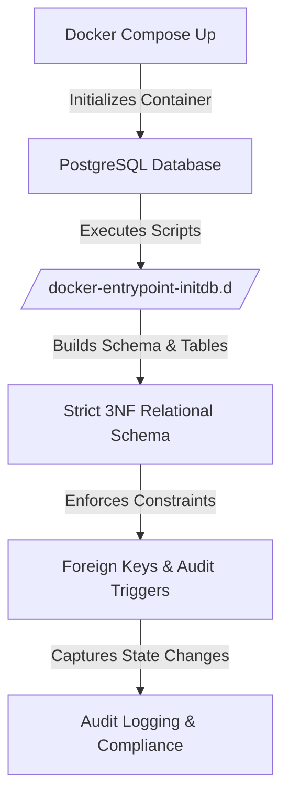

# Enterprise Asset Governance Database (`enterprise-asset-governance-db`)

An enterprise-grade relational database architecture engineered for strict regulatory compliance, relational data integrity, and automated system auditing.

## 🚀 Key Architectural Features
- **Strict 3NF Schema & Foreign Key Constraints:** Guarantees zero orphan records by enforcing strict parent-child relationships between entities like `locations` and `assets`.
- **Database-Level Automated Audit Triggers:** Utilizes `PL/pgSQL` triggers (`AFTER UPDATE`) to capture state modifications, old-to-new transitions, database users, and microsecond-precise timestamps natively without relying on application-layer tracking.
- **Performance Optimization:** Leverages strategic B-Tree indexing on high-frequency query columns (such as serial numbers and asset statuses) to minimize search latency.
- **Containerized Workflow:** Fully reproducible via Docker and Docker Compose with automated execution scripts mapped to `/docker-entrypoint-initdb.d`.

---

## 🔄 End-to-End Workflow Architecture


## 🛠️ Live Demonstration Proofs
```
## 🛠️ Live Demonstration Proofs

### 1. Enforcing Data Integrity (Foreign Key Constraints)
Attempting to insert a child asset referencing a non-existent location ID instantly throws a constraint violation error, preventing corrupt data:
```sql
ERROR: insert or update on table "assets" violates foreign key constraint "assets_location_id_fkey"
DETAIL: Key (location_id)=(1) is not present in table "locations".
ERROR: insert or update on table "assets" violates foreign key constraint "assets_location_id_fkey"
DETAIL: Key (location_id)=(1) is not present in table "locations".

SELECT * FROM audit_logs;
log_id | asset_id |                        action_type                        | changed_by |         timestamp          
--------+----------+-----------------------------------------------------------+------------+----------------------------
      1 |        2 | STATUS_CHANGE: OPERATIONAL -> MAINTENANCE                 | admin_user | 2026-08-10 02:20:34.300058

